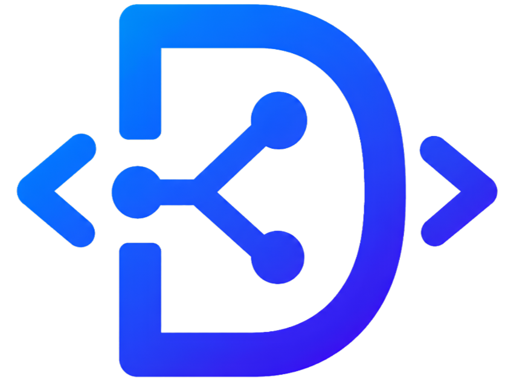

<p align="center">
  
</p>

<h1 align="center">Devman API</h1>

<p align="center"><strong>Build, run, and debug complete API workflows from one browser workspace.</strong></p>

<p align="center">Import OpenAPI, paste cURL commands, connect requests with captured values, and export a clear Markdown test report.</p>

<p align="center">
  <a href="https://github.com/MahmoudRumaneh/api-tool/actions/workflows/ci.yml"></a>
  
</p>

## Why Devman API?

Testing one endpoint is easy. Testing a real flow—create an account, capture its token, create a resource, reuse its ID, and verify later requests—is where the repetitive work starts.

Devman API keeps that complete flow in one place. Requests run sequentially, values captured from one response are available to every request that follows, and each result stays visible for inspection.

## Features

- Import OpenAPI 3.x or Swagger 2.0 from a JSON, YAML, or Swagger UI URL.
- Import Postman Collection v2.0/v2.1 JSON, including nested folders, variables, bearer tokens, API keys, and request bodies.
- Paste endpoint lines or complete cURL commands from Bash, PowerShell, or Windows Command Prompt.
- Run individual endpoints, selected groups, or the full workflow in order.
- Reuse values with `${VARIABLE_NAME}` placeholders and jq-based response captures.
- Manage multiple bearer-token profiles and inspect JWT metadata without leaving the page.
- Send raw JSON, multipart form data, binary files, custom headers, and cookies.
- Validate expected HTTP statuses and jq assertions; either kind of mismatch fails the test.
- Search, reorder, duplicate, rename, collapse, and selectively run endpoint groups.
- Retry transient network and server failures automatically.
- Import/export reusable JSON suites and download run results as Markdown reports.
- Keep work in browser storage with responsive light and dark themes.
- Run locally or deploy as a serverless Vercel application.

## Quick start

### Requirements

- [Node.js 24](https://nodejs.org/)
- npm
- Optional: [`jq`](https://jqlang.github.io/jq/) for assertions and captures when using the local Node server

### Run locally

```bash
git clone https://github.com/MahmoudRumaneh/api-tool.git
cd api-tool
npm ci
npm start
```

Open [http://127.0.0.1:8787](http://127.0.0.1:8787).

On macOS or Linux, `./start.sh` starts the same local server and attempts to open the browser automatically. Set another port when needed:

```bash
PORT=9000 ./start.sh
```

## Your first API flow

1. Enter the API's base URL in **Connection**.
2. Add any bearer tokens needed by the endpoints.
3. Add requests by importing Swagger/OpenAPI, a Postman collection, a Devman suite, pasting cURL, or entering routes such as:

   ```text
   POST /auth/login
   GET /users/me
   PATCH /users/${USER_ID}
   ```

4. Arrange related requests into groups. Groups and their endpoints run from top to bottom.
5. Set the expected status for each request, then select **Run all**.
6. Inspect response headers and bodies, captured variables, timing, retry count, and pass/fail results.
7. Download a Markdown report or export the workspace as JSON for later use.

> [!CAUTION]
> Exported suite JSON can contain pasted tokens. Review exported files before sharing or committing them.

## Importing cURL

Paste one or more complete commands into **Quick add endpoints**. Devman API imports the URL, method, headers, cookies, body, and supported upload definitions.

```bash
curl 'https://api.example.com/users' \
  -X POST \
  -H 'authorization: Bearer ${API_TOKEN}' \
  -H 'content-type: application/json' \
  --data '{"name":"Ada"}'
```

File paths from a copied cURL command are never read automatically. Select upload files again in the browser before running the request.

## Import compatibility

| Source | Supported content |
| --- | --- |
| OpenAPI / Swagger | OpenAPI 3.x, Swagger 2.0, JSON, YAML, Swagger UI discovery, path/query/header/cookie parameters, JSON, text, URL-encoded, multipart, and binary request bodies. |
| Postman | Collection v2.0/v2.1, nested folders, collection variables, bearer tokens, API keys, raw, URL-encoded, multipart, binary, and GraphQL bodies. |
| cURL | Bash, PowerShell, and Windows Command Prompt syntax, including headers, cookies, raw bodies, forms, and file-upload placeholders. |
| Devman JSON | Exported workspaces, staged suites, token-only JSON, variables, captures, jq assertions, `foreach`, and known-bug markers. |

Postman environments are separate files and are not embedded in a collection export. Import collection variables automatically, then enter any missing environment values through Devman's variable controls. Postman pre-request scripts, test scripts, certificates, proxy settings, and unsupported authentication schemes are not executed; recreate the relevant checks with Devman variables and jq assertions.

OpenAPI callbacks, webhooks, and non-HTTP operations are not converted into executable rows.

## Suite format

Devman API accepts its own exported workspaces and staged suite files. A minimal staged suite looks like this:

```json
{
  "base_url": "https://api.example.com/v1",
  "tokens": {
    "API_TOKEN": ""
  },
  "vars": {},
  "steps": [
    {
      "name": "create user",
      "stage": 10,
      "method": "POST",
      "path": "/users",
      "auth_var": "API_TOKEN",
      "body": {
        "name": "Ada Lovelace"
      },
      "expect_status": 201,
      "assert": ".data.id != null",
      "capture": {
        "USER_ID": ".data.id"
      }
    },
    {
      "name": "read user",
      "stage": 20,
      "method": "GET",
      "path": "/users/${USER_ID}",
      "auth_var": "API_TOKEN",
      "expect_status": 200
    }
  ]
}
```

Important fields:

| Field | Purpose |
| --- | --- |
| `stage` | Groups requests and controls execution order. |
| `auth_var` | Names the variable used as the bearer token. |
| `expect_status` | Sets the expected HTTP status code. |
| `assert` | Runs one jq expression, or an array of expressions, against the JSON response. |
| `capture` | Maps variable names to jq filters. Captured values are available to later steps. |
| `continue_on_fail` | Allows later requests to continue after this request fails. |
| `foreach` | Expands one step across a list of supplied values. |

Use **Download template** in the app for a ready-to-edit example.

## Scripts

| Command | Description |
| --- | --- |
| `npm start` | Starts the local server at `127.0.0.1:8787`. |
| `npm run lint` | Runs ESLint with zero warnings allowed. |
| `npm test` | Runs the complete Node test suite. |
| `npm run dev` | Starts the project with the Vercel CLI when it is installed. |

The frontend is plain HTML, CSS, and JavaScript, so there is no frontend build step.

## Deployment

The included [`vercel.json`](vercel.json) and serverless functions under [`api/`](api/) are ready for Vercel:

1. Fork this repository.
2. Import the fork into Vercel.
3. Keep the project framework set to **Other** and deploy.
4. Optionally set `ALLOWED_PROXY_HOSTS` to a comma-separated hostname allowlist, for example `api.example.com,staging-api.example.com`.

Hosted deployments reject localhost, private networks, reserved IP addresses, credential-bearing URLs, and non-HTTP protocols. `ALLOWED_PROXY_HOSTS` is strongly recommended for any shared deployment.

## Security and privacy

Devman API handles credentials and forwards HTTP requests, so treat each deployment as a trusted tool:

- Use a local instance for private/internal APIs. The local server binds to `127.0.0.1` only.
- Do not paste production secrets into a deployment you do not control.
- Workspace state, including pasted tokens, is stored in the browser's local storage.
- Requests are forwarded through the local server or the deployment's serverless proxy to avoid browser CORS restrictions.
- Public deployments cannot reach private network targets; configure `ALLOWED_PROXY_HOSTS` to restrict public targets further.
- The built-in issue reporter never adds URLs, tokens, tenant IDs, request bodies, or responses to its diagnostics.
- Always remove sensitive data from reports, screenshots, exports, and GitHub issues before sharing them.

If you discover a security vulnerability, do not publish credentials or exploit details in a public issue. Contact the maintainer privately through [mhmoud.life](https://mhmoud.life).

See [SECURITY.md](SECURITY.md) for the complete reporting policy.

## Project structure

```text
api-tool/
├── api/       # Vercel serverless endpoints
├── lib/       # Shared proxy, retry, security, and OpenAPI logic
├── public/    # Browser application and reusable frontend utilities
├── test/      # Node test suite
├── server.js  # Local-only HTTP server
└── vercel.json
```

## Contributing

Contributions are welcome:

1. [Open an issue](https://github.com/MahmoudRumaneh/api-tool/issues/new) for a bug or proposed change.
2. Fork the repository and create a focused branch.
3. Install dependencies with `npm ci`.
4. Make the change and add tests where appropriate.
5. Run `npm test` and manually check the affected UI on desktop and mobile.
6. Open a pull request that explains what changed and why.

Please keep changes focused, avoid committing tokens or generated reports, and preserve compatibility with both the local server and Vercel deployment.

## Report an issue

Use **Report an issue** in the website footer. It opens a pre-filled GitHub issue with safe diagnostics about the current app and workspace.

You can also [open a GitHub issue directly](https://github.com/MahmoudRumaneh/api-tool/issues/new?title=%5BBug%5D+&body=%23%23+What+happened%3F%0A%0APlease+describe+the+problem+and+what+you+were+trying+to+do.%0A%0A%23%23+Steps+to+reproduce%0A%0A1.+%0A2.+%0A3.+%0A%0A%23%23+Expected+behavior%0A%0AWhat+did+you+expect+Devman+API+to+do%3F%0A%0A%23%23+Extra+notes%0A%0AAdd+screenshots+or+a+screen+recording+if+they+would+help.).

When reporting a problem, include the smallest reproducible suite you can share safely and remove all credentials and private API data.

---

Built by [Mahmoud Rumaneh](https://mhmoud.life).
